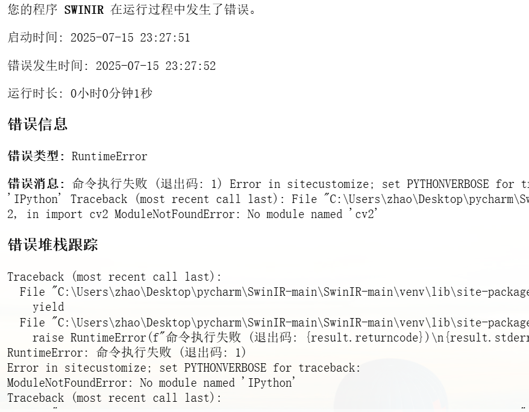

# PyEmailMonitor - 程序执行监控与邮件通知系统


PyEmailMonitor 是一个 Python 库，用于监控程序执行状态并通过电子邮件发送通知。它可以在程序开始、成功完成或发生错误时自动发送通知邮件。

## 功能特点

- 📧 通过 SMTP 发送邮件通知
- ⏱️ 自动计算程序运行时长
- 🚨 详细的错误报告（包含堆栈跟踪）
- ⚙️ 支持命令行配置
- 🔒 支持 SSL/TLS 加密连接
- 🧪 内置测试模式

## 安装方式

### 从 PyPI 安装（推荐）

```bash
pip install pyemailmonitor
```

### 从 GitHub 源码安装

1. 克隆仓库：

```bash
git clone https://github.com/PoseZhaoyutao/pyemailmonitor.git
cd pyemailmonitor
```

2. 使用 pip 安装：

```bash
pip install .
```

或者以开发模式安装（便于修改代码）：

```bash
pip install -e .
```

## 配置指南

### 1. 配置个人信息

在使用前，您需要先配置个人信息：

```bash
email-monitor configure \
    --user-name "您的姓名" \
    --user-email "您的邮箱@example.com" \
    --sender-name "系统监控"  # 可选
```

配置信息将保存在 `~/.pyemailmonitor_config.json`

### 2. 查看当前配置

```bash
email-monitor show-config
```

## 使用方式

### 命令行使用

#### 基本用法


直接配置自己邮箱即可，默认有分发邮箱，直接执行下一步程序即可。

```bash
email-monitor run "您的程序名称" \
    --smtp-server "smtp.example.com" \
    --smtp-port 465 \
    --smtp-user "您的SMTP用户名" \
    --smtp-password "您的SMTP密码" \
    --ssl  # 使用SSL加密（默认启用）
```

#### 监控外部命令

```bash
email-monitor run "数据分析任务" \
    --smtp-server "smtp.example.com" \
    --smtp-port 465 \
    --smtp-user "system@example.com" \
    --smtp-password "your_password" \
    python data_analysis.py --input data.csv
```

#### 添加抄送收件人

```bash
email-monitor run "任务名称" \
    ...其他参数... \
    --cc "同事1@example.com,同事2@example.com"
```

#### 测试模式（不实际发送邮件）

```bash
email-monitor run "测试任务" \
    ...其他参数... \
    --test-mode \
    echo "这是一个测试"
```

### Python API 使用

```python
from pyemailmonitor.monitor import EmailMonitor
from pyemailmonitor.cli import get_config

# 加载保存的配置
config = get_config()

# 创建监控器
monitor = EmailMonitor(
    user_name=config["user_name"],
    user_email=config["user_email"],
    smtp_server="smtp.example.com",
    smtp_port=465,
    smtp_user="system@example.com",
    smtp_password="your_password",
    sender_name=config.get("sender_name", "System Monitor")
)

# 添加额外的收件人
monitor.add_recipient("同事@example.com", "同事姓名")

# 使用监控器
with monitor.monitor("我的数据处理程序"):
    # 这里是您的程序代码
    process_data()
```

## 常见服务商配置示例

### Gmail

```bash
email-monitor run "Gmail测试" \
    --smtp-server "smtp.gmail.com" \
    --smtp-port 465 \
    --smtp-user "your@gmail.com" \
    --smtp-password "your_app_password"  # 使用应用专用密码
```

### 腾讯企业邮箱

```bash
email-monitor run "企业邮箱测试" \
    --smtp-server "smtp.exmail.qq.com" \
    --smtp-port 465 \
    --smtp-user "your@company.com" \
    --smtp-password "your_password"
```

### Office 365

```bash
email-monitor run "Office365测试" \
    --smtp-server "smtp.office365.com" \
    --smtp-port 587 \
    --no-ssl  # 使用STARTTLS \
    --smtp-user "your@company.com" \
    --smtp-password "your_password"
```

### 自定义邮件模板

您可以修改 `pyemailmonitor/templates.py` 文件来自定义邮件模板。

## 故障排除

如果遇到连接问题，可以尝试：

1. 检查端口和加密设置是否匹配（SSL:465 / STARTTLS:587）
2. 使用测试命令诊断连接问题
3. 确保防火墙允许出站连接
4. 对于Gmail，确保使用应用专用密码

常见错误解决方案：
- `[SSL: WRONG_VERSION_NUMBER]`: 尝试切换端口或加密方式
- 认证失败: 检查用户名密码是否正确

## 贡献指南

欢迎提交 Issue 或 Pull Request！

1. Fork 仓库
2. 创建特性分支 (`git checkout -b feature/your-feature`)
3. 提交更改 (`git commit -am 'Add some feature'`)
4. 推送到分支 (`git push origin feature/your-feature`)
5. 创建 Pull Request

## 许可证

本项目采用 MIT 许可证 - 详情请参阅 [LICENSE](LICENSE) 文件。